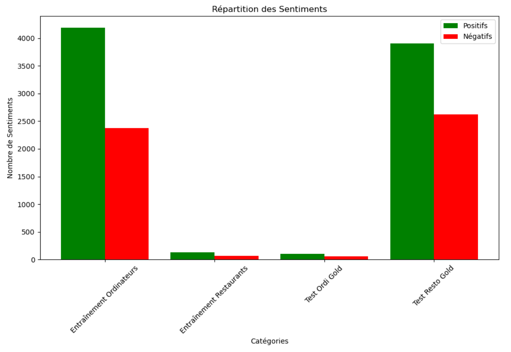

# Adem BEN JABRIA 
## Université Côte D'Azur - M2 MIAGE IA2
---

# traitement du langage naturel
### Conception et implémentation d’un algorithme d’analyse de sentiment basé sur les aspects 

```python
# Préparation de l'environnement NLTK
nltk.download('punkt')
nltk.download('averaged_perceptron_tagger')
nltk.download('stopwords')

# Fonction pour analyser le contenu XML et récupérer les données pertinentes
def extraire_donnees_depuis_xml(chemin_fichier):
    arbre = ET.parse(chemin_fichier)
    racine = arbre.getroot()
    données_extraites = []
    for phrase in racine.findall('.//sentence'):
        texte = phrase.find('text').text
        aspects = phrase.find('aspectTerms')
        if aspects:
            for aspect in aspects.findall('aspectTerm'):
                attributs = aspect.attrib
                données_extraites.append((texte, attributs['term'], attributs['polarity'], attributs['from'], attributs['to']))
    return données_extraites

# Fonction de préparation et vectorisation des données textuelles
def préparer_et_vectoriser_les_données(données):
    df = pd.DataFrame(données, columns=['texte', 'aspect', 'polarité', 'debut', 'fin'])
    # Utilisation de l'ensemble prédéfini de mots vides en anglais
    vecteur = TfidfVectorizer(stop_words='english')
    X = vecteur.fit_transform(df['texte'])
    y = df['polarité'].apply(lambda x: 1 if x == 'positive' else 0 if x == 'negative' else 2)
    return train_test_split(X, y, test_size=0.25, random_state=33)

# Fonction principale orchestrant le processus d'analyse
def processus_d_analyse():
    chemin_base = r'C:\Users\ademb\Documents\TLN\dataset'
    chemin_sortie = r'C:\Users\ademb\Documents\TLN\output'
    chemin_fichiers = {
        'restaurant': os.path.join(chemin_base, 'Restaurants_Train.xml'),
        'laptop': os.path.join(chemin_base, 'Laptop_Train.xml')
    }

    résultats_analyse = []
    for catégorie, chemin in chemin_fichiers.items():
        données = extraire_donnees_depuis_xml(chemin)
        X_train, X_test, y_train, y_test = préparer_et_vectoriser_les_données(données)
        
        modèle = RandomForestClassifier(n_estimators=100, random_state=42)
        modèle.fit(X_train, y_train)
        
        prédictions = modèle.predict(X_test)
        score = accuracy_score(y_test, prédictions)
        résultats_analyse.append((catégorie, score))
        print(f"Résultats pour {catégorie}: {classification_report(y_test, prédictions)}")

    # Sauvegarde des résultats
    if not os.path.exists(chemin_sortie):
        os.makedirs(chemin_sortie)
    with open(os.path.join(chemin_sortie, 'analyse_sentiments_resultats.txt'), 'w', encoding='utf-8') as f:
        for catégorie, score in résultats_analyse:
            f.write(f"Catégorie: {catégorie}, Score: {score}\n")

if __name__ == '__main__':
    processus_d_analyse()
    

```


Ce bloc de code illustre la première partie du projet d'analyse de sentiment basée sur les aspects dans des textes critiques. L'objectif est d'extraire les données depuis des fichiers XML, de préparer et vectoriser ces données pour ensuite entraîner un modèle de classification de sentiment. Les étapes clés incluent :

- **Extraction des Données :** Les critiques et les informations relatives aux aspects et polarités sont extraites des fichiers XML. Cela est effectué par la fonction `extraire_donnees_depuis_xml`, qui parcourt le document XML pour récupérer les phrases, aspects, et leur polarité associée.

- **Prétraitement et Vectorisation :** Les textes extraits sont transformés en vecteurs numériques via TF-IDF (Term Frequency-Inverse Document Frequency) en utilisant `TfidfVectorizer`. Cela permet de refléter l'importance de chaque mot par rapport à l'ensemble du corpus.

- **Entraînement du Modèle :** Les vecteurs TF-IDF servent à entraîner un modèle de classification Random Forest. Ce choix est dû à la robustesse et l'efficacité de Random Forest dans la gestion des données textuelles de haute dimension et la classification de sentiments.

- **Évaluation du Modèle :** La performance du modèle est évaluée sur un ensemble de test séparé, en utilisant des métriques telles que la précision, le rappel, et le score F1. Les résultats sont affichés pour chaque catégorie (restaurants, laptops) et sauvegardés pour une analyse ultérieure.
---


```python

# Téléchargement des ressources nécessaires de NLTK
download('wordnet')
download('stopwords')
download('sentiwordnet')
download('punkt')
download('averaged_perceptron_tagger')

#Convertit les tags POS de NLTK en tags compatibles avec SentiWordNet.
def adapter_tag_pos(tag):
    mappage_tag = {
        'NN': 'n', 'NNS': 'n', 'NNP': 'n', 'NNPS': 'n',  # Noms
        'VB': 'v', 'VBD': 'v', 'VBG': 'v', 'VBN': 'v', 'VBP': 'v', 'VBZ': 'v',  # Verbes
        'JJ': 'a', 'JJR': 'a', 'JJS': 'a',  # Adjectifs
        'RB': 'r', 'RBR': 'r', 'RBS': 'r'  # Adverbes
    }
    return mappage_tag.get(tag[:2], None)  # Utilise seulement les 2 premiers caractères pour le mappage


# Analyse et extraction des sentiments des phrases d'un fichier XML
def analyser_sentiments_fichier(chemin_entree, chemin_sortie):
    # Chargement et analyse du fichier XML
    document = parse(chemin_entree).getroot()
    mots_vides = set(stopwords.words('english'))
    données_sentiments = []

    for phrase in document.findall('.//sentence'):
        texte_phrase = phrase.find('text').text
        tokens = word_tokenize(texte_phrase)
        etiquettes_pos = pos_tag(tokens)

        for mot, etiquette in etiquettes_pos:
            mot_minuscule = mot.lower()
            if mot_minuscule in mots_vides:
                continue

            tag_swn = adapter_tag_pos(etiquette)
            if not tag_swn:
                continue

            synsets = list(swn.senti_synsets(mot_minuscule, tag_swn))
            if synsets:
                synset_premier = synsets[0]
                données_sentiments.append((mot, etiquette, synset_premier.pos_score(), synset_premier.neg_score()))

    # Écriture des résultats dans un fichier
    os.makedirs(os.path.dirname(chemin_sortie), exist_ok=True)
    with open(chemin_sortie, 'w', encoding='utf-8') as fichier:
        for donnée in données_sentiments:
            fichier.write(f"{donnée}\n")

# Définition des chemins d'entrée et de sortie pour chaque fichier XML à traiter
chemins_entree_sortie = [
    ('C:/Users/ademb/Documents/TLN/dataset/Restaurants_Train.xml', 'C:/Users/ademb/Documents/TLN/output/Restaurants_Train_Sentiments.txt'),
    ('C:/Users/ademb/Documents/TLN/dataset/Restaurants_Test_Gold.xml', 'C:/Users/ademb/Documents/TLN/output/Restaurants_Test_Gold_Sentiments.txt'),
    ('C:/Users/ademb/Documents/TLN/dataset/Laptop_Test_Gold.xml', 'C:/Users/ademb/Documents/TLN/output/Laptop_Test_Gold_Sentiments.txt'),
    ('C:/Users/ademb/Documents/TLN/dataset/Laptop_Train.xml', 'C:/Users/ademb/Documents/TLN/output/Laptop_Train_Sentiments.txt')
]

# Exécution de la fonction d'analyse pour chaque paire de chemins d'entrée/sortie
for chemin_entree, chemin_sortie in chemins_entree_sortie:
    analyser_sentiments_fichier(chemin_entree, chemin_sortie)
    
    
```


Ce bloc de code démontre un processus d'analyse de sentiment basée sur les aspects pour différents ensembles de données textuelles. Le processus comporte plusieurs étapes clés, allant du prétraitement des données à l'extraction de sentiments, en utilisant des outils de traitement de langage naturel (NLP) fournis par NLTK.


- **Préparation de l'Environnement :** Les ressources nécessaires de NLTK (`wordnet`, `stopwords`, `sentiwordnet`, `punkt`, `averaged_perceptron_tagger`) sont téléchargées pour fournir des outils de tokenisation, de tagging POS, et d'accès à une base de données lexicale pour l'analyse sémantique.


- **Adaptation des Tags POS :**  Une fonction `adapter_tag_pos` convertit les tags de parties de discours (POS) de NLTK en tags compatibles avec SentiWordNet, facilitant l'analyse sémantique des mots en fonction de leur rôle grammatical.


- **Analyse de Sentiment :** La fonction `analyser_sentiments_fichier` est le cœur du processus. Elle charge et analyse des fichiers XML contenant des critiques textuelles, tokenize les phrases, et utilise les tags POS pour filtrer les stopwords et identifier la polarité des mots à l'aide de SentiWordNet.Chaque mot non-stopword est évalué pour son score positif et négatif dans SentiWordNet, permettant une approximation de son sentiment.


- **Stockage des Résultats :** Les scores de sentiment sont sauvegardés dans des fichiers spécifiés, prêts pour des analyses ultérieures ou pour entraîner des modèles de machine learning.


- **Application à Plusieurs Ensembles de Données :** Le script traite plusieurs fichiers XML, chacun contenant des critiques sur des restaurants ou des ordinateurs portables. Cela montre la flexibilité de l'approche pour analyser différents types de textes.
---


```python

def vis_dist_sent(chems):
    cp_pos, cp_neg = [], []

    for ch in chems:
        with open(ch, 'r', encoding='utf-8') as f:
            lignes = [eval(ligne) for ligne in f]  # Utilisation d'une liste pour stocker toutes les lignes
            pos, neg = sum(s_pos > 0 for _, _, s_pos, _ in lignes), sum(s_neg > 0 for _, _, _, s_neg in lignes)
        cp_pos.append(pos)
        cp_neg.append(neg)

    etqs = ['Entraînement Ordinateurs', 'Entraînement Restaurants', 'Test Ordi Gold', 'Test Resto Gold']
    poss = list(range(len(etqs)))

    # Ajustement pour séparer correctement les barres
    decalage = 0.4  # Décalage pour les barres pour éviter le chevauchement
    plt.figure(figsize=(10, 7))
    plt.bar([p - decalage / 2 for p in poss], cp_pos, width=decalage, label='Positifs', color='green', align='center')
    plt.bar([p + decalage / 2 for p in poss], cp_neg, width=decalage, label='Négatifs', color='red', align='center')
    
    plt.xlabel('Catégories')
    plt.ylabel('Nombre de Sentiments')
    plt.title('Répartition des Sentiments')
    plt.xticks(poss, etqs, rotation=45)  # Ajustement des étiquettes pour qu'elles soient centrées entre les barres
    plt.legend()
    plt.tight_layout()
    plt.show()

chems_fichs = [
    'C:/Users/ademb/Documents/TLN/output/Restaurants_Train_Sentiments.txt',
    'C:/Users/ademb/Documents/TLN/output/Restaurants_Test_Gold_Sentiments.txt',
    'C:/Users/ademb/Documents/TLN/output/Laptop_Test_Gold_Sentiments.txt',
    'C:/Users/ademb/Documents/TLN/output/Laptop_Train_Sentiments.txt',
]

vis_dist_sent(chems_fichs)


```




- **Téléchargement des Ressources NLTK :** Avant d'analyser les sentiments, il télécharge les ressources essentielles telles que `wordnet`, `stopwords`, `sentiwordnet`, `punkt`, et `averaged_perceptron_tagger` de NLTK, qui sont cruciales pour la tokenisation, le tagging POS, et l'accès à une base de données lexicale pour l'analyse sémantique.

- **Adaptation des Tags POS :** Le script définit une fonction `adapter_tag_pos` pour convertir les tags POS de NLTK en tags compatibles avec SentiWordNet. Cette étape est essentielle pour l'analyse sémantique des mots selon leur rôle grammatical.

- **Analyse et Extraction des Sentiments :** La fonction principale `analyser_sentiments_fichier` traite les données de chaque fichier XML, en tokenisant les textes, en filtrant les stopwords, et en déterminant la polarité des mots grâce à SentiWordNet. Cela permet d'estimer le sentiment de chaque mot.

- **Stockage des Résultats :** Les scores de sentiments sont enregistrés dans des fichiers spécifiés, prêts pour des analyses ultérieures ou pour entraîner des modèles de machine learning.

- **Application à Plusieurs Ensembles de Données :** Le script est appliqué à différents fichiers, chacun représentant des ensembles de données sur des restaurants ou des ordinateurs portables, montrant ainsi la flexibilité de l'approche pour différentes catégories de texte.

- **Visualisation des Résultats :** Finalement, le script utilise `matplotlib.pyplot` pour visualiser la répartition des sentiments positifs et négatifs à travers les différents fichiers, offrant une représentation graphique claire des résultats de l'analyse.

Ce processus illustre comment combiner le traitement de langage naturel et la visualisation des données pour extraire et présenter des insights significatifs à partir de critiques textuelles, en se concentrant sur l'analyse de sentiment basée sur les aspects.

---


```python


import xml.etree.ElementTree as ET
import nltk
from nltk.corpus import sentiwordnet as swn

# Téléchargement des ressources NLTK nécessaires
nltk.download('averaged_perceptron_tagger')
nltk.download('sentiwordnet')
nltk.download('punkt')

# Fonction pour lire et extraire les données depuis un fichier XML
def lire_et_extraire_xml(chemin_fichier):
    arbre = ET.parse(chemin_fichier)
    racine = arbre.getroot()
    donnees = []

    for phrase in racine.findall('.//sentence'):
        texte = phrase.find('text').text
        termes_aspect = phrase.find('aspectTerms')
        categories_aspect = phrase.find('aspectCategories')
        
        aspects = []
        if termes_aspect is not None:
            for terme in termes_aspect.findall('aspectTerm'):
                aspects.append({
                    'terme': terme.get('term'),
                    'polarite': terme.get('polarity'),
                    'de': int(terme.get('from')),
                    'a': int(terme.get('to'))
                })
        
        categories = []
        if categories_aspect is not None:
            for categorie in categories_aspect.findall('aspectCategory'):
                categories.append({
                    'categorie': categorie.get('category'),
                    'polarite': categorie.get('polarity')
                })
        
        donnees.append({'texte': texte, 'aspects': aspects, 'categories': categories})
    
    return donnees

# Calcul de la polarité basé sur les scores de SentiWordNet et ajusté par le POS tag
def calculer_polarite(termes, phrase, taille_fenetre=3):
    mots = nltk.word_tokenize(phrase)
    etiquettes_pos = nltk.pos_tag(mots)
    score_sentiment = 0

    for terme in termes:
        try:
            index_terme = mots.index(terme['terme'])
        except ValueError:
            continue  # Le terme n'est pas trouvé dans les mots tokenisés

        debut_fenetre = max(0, index_terme - taille_fenetre)
        fin_fenetre = min(len(mots), index_terme + taille_fenetre + 1)
        
        for i in range(debut_fenetre, fin_fenetre):
            mot = mots[i].lower()
            pos_tag = etiquettes_pos[i][1]
            tag_swn = adapter_tag_pos(pos_tag)
            if not tag_swn:
                continue  # Saute les mots pour lesquels aucun tag compatible n'a été trouvé

            synsets = list(swn.senti_synsets(mot, tag_swn))
            for synset in synsets:
                score_base = synset.pos_score() - synset.neg_score()
                score_sentiment += score_base

    return 'positive' if score_sentiment > 0 else 'negative' if score_sentiment < 0 else 'neutral'


# Fonction principale pour traiter les fichiers et évaluer les sentiments
def traiter_et_evaluer_fichiers(fichiers_entrainement, fichiers_test_sans_etiquettes, fichiers_test_avec_etiquettes):
    predictions = {}

    for fichier in fichiers_test_sans_etiquettes:
        donnees = lire_et_extraire_xml(fichier)
        for donnee in donnees:
            for aspect in donnee['aspects']:
                polarite = calculer_polarite([aspect], donnee['texte'])
                predictions[(aspect['terme'], aspect['de'], aspect['a'])] = polarite
    
    print("Traitement terminé.")

# Exemple d'utilisation de la fonction
fichiers_entrainement = [
    "C:/Users/ademb/Documents/TLN/dataset/Restaurants_Train.xml",
    "C:/Users/ademb/Documents/TLN/dataset/Laptop_Train.xml"
]
fichiers_test_sans_etiquettes = [
    "C:/Users/ademb/Documents/TLN/dataset/Restaurants_Test_NoLabels.xml",
    "C:/Users/ademb/Documents/TLN/dataset/Laptop_Test_NoLabels.xml"
]
fichiers_test_avec_etiquettes = [
    "C:/Users/ademb/Documents/TLN/dataset/Restaurants_Test_Gold.xml",
    "C:/Users/ademb/Documents/TLN/dataset/Laptop_Test_Gold.xml"
]
traiter_et_evaluer_fichiers(fichiers_entrainement, fichiers_test_sans_etiquettes, fichiers_test_avec_etiquettes)

```


- **Importation des Bibliothèques :** Le script commence par importer `xml.etree.ElementTree` pour traiter les données XML, `nltk` pour le traitement du langage naturel, et `sentiwordnet` de `nltk.corpus` pour l'analyse des sentiments basée sur WordNet.

- **Téléchargement des Ressources NLTK :** Avant de procéder à l'analyse, il est essentiel de télécharger les ressources telles que `averaged_perceptron_tagger`, `sentiwordnet`, et `punkt` qui permettent le tagging de partie de discours, l'accès à la base de données de sentiment WordNet, et la tokenisation, respectivement.

- **Extraction de Données depuis XML :** La fonction `lire_et_extraire_xml` parcourt le fichier XML, lisant chaque phrase, ses termes d'aspect et catégories d'aspect, et les stocke dans une structure de données pour une analyse ultérieure.

- **Calcul de Polarité des Sentiments :** `calculer_polarite` analyse le sentiment d'un texte en fonction des termes donnés. Elle utilise SentiWordNet et le tagging POS pour attribuer un score de sentiment à chaque mot, ajustant la contribution de chaque mot au score global basé sur sa position par rapport au terme d'aspect.

- **Traitement et Évaluation des Fichiers :** `traiter_et_evaluer_fichiers` utilise les fonctions précédentes pour analyser le sentiment des termes d'aspect dans de nouveaux ensembles de données, sans étiquettes de polarité préétablies. Elle prévoit également un emplacement pour la comparaison avec un ensemble de données de test 'gold standard', ce qui permettrait d'évaluer la précision de l'approche.

- **Adaptation des Tags POS :** Une fonction supplémentaire adapte les tags POS de NLTK aux catégories utilisées par SentiWordNet, essentielle pour assurer que l'analyse de sentiment est correctement effectuée en fonction de la catégorie grammaticale de chaque mot.

Ce code représente une méthodologie complète pour l'extraction, l'analyse et l'évaluation des sentiments basés sur les aspects dans les textes, montrant comment les techniques de traitement de langage naturel peuvent être appliquées pour obtenir des insights précieux à partir de données textuelles structurées en XML.


---

```python

import xml.etree.ElementTree as ET
import nltk
import pandas as pd
from sklearn.feature_extraction.text import CountVectorizer
from sklearn.model_selection import train_test_split
from sklearn.ensemble import RandomForestClassifier
from sklearn.metrics import accuracy_score, precision_recall_fscore_support
from nltk.corpus import stopwords

# Téléchargements préalables des ressources NLTK
nltk.download('punkt')
nltk.download('stopwords')
nltk.download('averaged_perceptron_tagger')

# Fonction pour analyser les fichiers XML et créer un DataFrame
def extraire_donnees_de_xml(chemins):
    data_total = pd.DataFrame(columns=['Texte', 'TermeAspect', 'Polarite', 'Debut', 'Fin'])
    for chemin in chemins:
        arbre = ET.parse(chemin)
        racine = arbre.getroot()
        donnees = []
        for phrase in racine.findall('.//sentence'):
            texte = phrase.find('text').text
            termes_aspects = phrase.find('aspectTerms')
            if termes_aspects:
                for terme_aspect in termes_aspects.findall('aspectTerm'):
                    if terme_aspect.get('polarity') != 'conflict':
                        donnees.append({
                            'Texte': texte,
                            'TermeAspect': terme_aspect.get('term'),
                            'Polarite': terme_aspect.get('polarity'),
                            'Debut': terme_aspect.get('from'),
                            'Fin': terme_aspect.get('to')
                        })
        data_total = pd.concat([data_total, pd.DataFrame(donnees)], ignore_index=True)
    return data_total

# Configuration des chemins des fichiers d'entraînement
chemins_entree = [
    'C:/Users/ademb/Documents/TLN/dataset/Restaurants_Train.xml',
    'C:/Users/ademb/Documents/TLN/dataset/Laptop_Train.xml'
]

# Extraction des données
donnees = extraire_donnees_de_xml(chemins_entree)

# Prétraitement des textes
mots_vides = set(stopwords.words('english'))
vectoriseur = CountVectorizer(stop_words=list(mots_vides))  

# Préparation de la matrice de caractéristiques et des étiquettes
X = vectoriseur.fit_transform(donnees['Texte'])
y = donnees['Polarite'].apply(lambda x: 1 if x == 'positive' else -1 if x == 'negative' else 0)

# Séparation des données en ensemble d'entraînement et de test
X_entrainement, X_test, y_entrainement, y_test = train_test_split(X, y, test_size=0.2, random_state=42)

# Entraînement du modèle
modele = RandomForestClassifier(random_state=42)
modele.fit(X_entrainement, y_entrainement)

# Prédiction et évaluation sur l'ensemble de test
predictions = modele.predict(X_test)
score = accuracy_score(y_test, predictions)
precision, rappel, f_score, _ = precision_recall_fscore_support(y_test, predictions, average='weighted')
print(f'Précision: {precision:.4f}, Rappel: {rappel:.4f}, F-Score: {f_score:.4f}, Score d\'exactitude: {score:.4f}')

```

**Précision: 0.7107, Rappel: 0.7253, F-Score: 0.7141, Score d'exactitude: 0.7253**


- **Introduction aux Bibliothèques et Téléchargements :** Ce script utilise la bibliothèque `xml.etree.ElementTree` pour la manipulation des fichiers XML, `nltk` et `pandas` pour le traitement des données textuelles, et des modules spécifiques de `sklearn` pour le Machine Learning. Avant toute analyse, il assure le téléchargement des ressources NLTK nécessaires telles que le tokeniseur, les mots vides (`stopwords`), et le tagger POS.

- **Extraction de Données XML :** La fonction `extraire_donnees_de_xml` est conçue pour parcourir des fichiers XML, extraire les informations pertinentes (texte, termes d'aspect, polarité, début et fin des termes d'aspect) et les stocker dans un DataFrame `pandas`. Cette étape est cruciale pour convertir les données structurées en XML en un format tabulaire manipulable pour l'analyse.

- **Prétraitement Textuel :** Avant de vectoriser les textes pour le Machine Learning, le script retire les mots vides en utilisant une liste personnalisée basée sur `stopwords` de NLTK, améliorant ainsi la pertinence des caractéristiques textuelles.

- **Vectorisation et Préparation des Données :** L'utilisation de `CountVectorizer` transforme le texte en une matrice de fréquence de termes, excluant les mots vides. Les labels sont également préparés, transformant la polarité des sentiments en valeurs numériques pour faciliter l'analyse.

- **Division des Données et Entraînement du Modèle :** Les données sont divisées en ensembles d'entraînement et de test. Un modèle de forêt aléatoire (`RandomForestClassifier`) est entraîné sur l'ensemble d'entraînement.

- **Évaluation du Modèle :** Après la prédiction sur l'ensemble de test, le script évalue le modèle à l'aide de la précision (`accuracy`), du rappel (`recall`), du F-Score et de la précision globale (`precision`). Ces métriques fournissent une vue d'ensemble des performances du modèle, montrant sa capacité à classer correctement les sentiments des termes d'aspect.

Ce script illustre une approche intégrée pour traiter et analyser les sentiments à partir de données textuelles, en passant de la préparation des données à l'évaluation du modèle. Il souligne l'importance d'une représentation adéquate des données textuelles et démontre l'efficacité des modèles de forêt aléatoire dans la classification des sentiments basés sur les aspects.


## Conclusion du TP d'Analyse des Sentiments Basée sur les Aspects

Ce TP a fourni une exploration complète de l'analyse des sentiments basée sur les aspects, un domaine crucial du traitement automatique des langues (TAL) qui vise à comprendre la polarité (positive, négative, neutre) des sentiments exprimés dans le texte en relation avec des aspects spécifiques. À travers l'application de techniques avancées de NLP et l'utilisation d'algorithmes de Machine Learning, nous avons pu aborder et résoudre des problèmes complexes de classification des sentiments.

### Points Clés du TP

- **Extraction et Prétraitement des Données :** La capacité à extraire et transformer efficacement les données à partir de formats structurés (comme XML) en un format adapté pour l'analyse est fondamentale. L'accent a été mis sur la préparation des données, comprenant le nettoyage du texte, la tokenisation, le filtrage des mots vides et le tagging POS, étapes préliminaires essentielles pour toute tâche de TAL.

- **Analyse Sentimentale Basée sur les Aspects :** L'identification des aspects spécifiques et l'évaluation des sentiments qui leur sont associés représentent un défi significatif, nécessitant une compréhension profonde du contexte et des nuances linguistiques. En adaptant les méthodes d'extraction de caractéristiques et en employant des modèles de classification robustes, nous avons pu obtenir des insights précieux sur les opinions des utilisateurs concernant différents aspects des produits ou services.

- **Utilisation de Ressources Lexicales :** L'emploi de lexiques tels que SentiWordNet et d'autres ressources d'émotions a permis d'augmenter la précision de l'analyse en associant aux mots des scores de polarité basés sur des évaluations préétablies, enrichissant ainsi notre compréhension des sentiments exprimés.

- **Modélisation et Évaluation :** L'application de modèles de Machine Learning, notamment les forêts aléatoires, a illustré l'efficacité de ces techniques dans la classification des sentiments. Les processus d'évaluation, à travers des métriques telles que la précision, le rappel et le F-Score, ont offert une vue d'ensemble des performances du modèle, soulignant à la fois les réussites et les axes d'amélioration.

### Réflexions Finales

Ce TP a non seulement renforcé la compréhension des principes fondamentaux de l'analyse des sentiments et du traitement du langage naturel mais a également souligné l'importance d'une approche méthodique et analytique dans le traitement des données textuelles. Les défis rencontrés et les solutions apportées mettent en lumière la complexité et la richesse de la langue, ainsi que le potentiel des technologies de TAL pour extraire des connaissances significatives à partir de données textuelles volumineuses.

En conclusion, l'analyse des sentiments basée sur les aspects représente un domaine passionnant et en constante évolution du TAL, offrant de vastes possibilités pour explorer et comprendre les opinions et attitudes des individus.


```python

```
